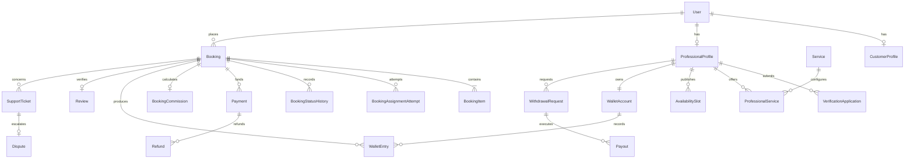

# 07 Database

## Document Status

- Status: Target v1 specification
- Implementation state: The current Prisma schema contains only the PostgreSQL datasource and
  client generator. The models, enums, constraints, migrations, and production seed data described
  here are planned and are not yet implemented.
- Canonical term: **Professional**. Older documents use _freelancer_ for the same marketplace role.

## Purpose

This document defines the target relational data model for the BeautyAtHome Phase 1 marketplace.
It translates the approved PRD and SRS into a PostgreSQL design without changing the launch scope:
beauty services, female Professionals, Sikar, and web/PWA delivery.

## Technology Baseline

- PostgreSQL is the system of record.
- Prisma ORM is the application data-access layer.
- Prisma migrations are the only supported production schema-change mechanism.
- The repository currently uses Prisma 7.8 and a PostgreSQL 18 local container.
- Redis, a separate search engine, event streaming, and database-per-module are not Phase 1
  requirements. A new datastore requires an architecture decision record.

## Data Design Principles

1. Store booking and money state in PostgreSQL transactions.
2. Preserve append-only history for booking, payment, commission, wallet, payout, dispute, and
   critical admin events.
3. Store money as integer paise and currency as `INR`; never use floating-point amounts.
4. Store timestamps as UTC `timestamptz`; render them in the user's applicable local timezone.
5. Use UUID primary keys and opaque public identifiers. Sequential internal IDs must not be exposed.
6. Snapshot commercial and service facts on a Booking so later catalogue or pricing edits cannot
   rewrite history.
7. Prefer soft deactivation for users and catalogue records. Financial and audit records are never
   hard-deleted through product APIs.
8. Protect personal data through least-privilege access, application-layer encryption where
   required, and private object storage for documents.

## Logical Module Ownership

| Module       | Owns                                                                                                    | May reference                              |
| ------------ | ------------------------------------------------------------------------------------------------------- | ------------------------------------------ |
| Identity     | User, UserRole, OtpChallenge, AuthSession                                                               | AuditEvent                                 |
| Geography    | City, ServiceArea                                                                                       | Address, ProfessionalProfile, Booking      |
| Professional | ProfessionalProfile, VerificationApplication, VerificationDocument, PortfolioAsset                      | User, City                                 |
| Catalogue    | ServiceCategory, Service, ProfessionalService                                                           | ProfessionalProfile                        |
| Availability | AvailabilitySlot                                                                                        | ProfessionalProfile, Booking               |
| Booking      | Booking, BookingItem, BookingAssignmentAttempt, BookingStatusHistory, CompletionChallenge               | Customer, Professional, catalogue, address |
| Payments     | Payment, PaymentAttempt, Refund, ProviderWebhookEvent                                                   | Booking                                    |
| Finance      | CommissionRule, BookingCommission, WalletAccount, WalletEntry, ClearanceHold, WithdrawalRequest, Payout | Booking, Professional, Payment             |
| Reviews      | Review                                                                                                  | Completed Booking                          |
| Support      | SupportTicket, TicketMessage, Dispute, DisputeEvidence                                                  | User, Booking, Payment, Payout             |
| Growth       | ReferralCode, Referral, RewardEntry, Coupon, CouponRedemption, RebookingReminder                        | User, Booking                              |
| Platform     | Notification, NotificationAttempt, OutboxEvent, AuditEvent, FraudSignal                                 | All modules through identifiers            |

Module ownership is enforced in application code. Cross-module writes must use the owning module's
service rather than writing its tables directly.

## Target Entity Catalogue

### Identity and Access

| Entity            | Required fields and rules                                                                                                                                                                                      |
| ----------------- | -------------------------------------------------------------------------------------------------------------------------------------------------------------------------------------------------------------- |
| `User`            | `id`, normalized E.164 `mobileNumber`, `status`, `createdAt`, `updatedAt`, optional `deletedAt`; mobile number is unique among non-deleted accounts.                                                           |
| `UserRole`        | Composite of `userId` and `role`; target roles are `CUSTOMER`, `PROFESSIONAL`, `ADMIN`, `SUPPORT`, and `FINANCE`. Operational roles are restricted admin subroles, not new customer types.                     |
| `CustomerProfile` | One-to-one with User; display name and approved profile attributes. Hidden risk data is not stored here.                                                                                                       |
| `OtpChallenge`    | Purpose, destination lookup, provider reference, hashed code, expiry, attempt count, consumed timestamp, request IP/device metadata. Authentication and booking-completion purposes are never interchangeable. |
| `AuthSession`     | User, hashed refresh-token identifier, device metadata, expiry, rotation lineage, revoked timestamp and reason. Raw refresh tokens are never stored.                                                           |

Target `UserStatus`: `ACTIVE`, `SUSPENDED`, `BLOCKED`, `CLOSED`. Professional onboarding readiness remains in the separate verification status rather than the User status.

### Geography and Addresses

| Entity                   | Required fields and rules                                                                                                                            |
| ------------------------ | ---------------------------------------------------------------------------------------------------------------------------------------------------- |
| `City`                   | Name, state, country code, timezone, launch status. Sikar is the only active Phase 1 city.                                                           |
| `ServiceArea`            | City, name, active status, and serviceability definition. Exact PIN-code or geofence strategy: **Decision pending — Product and Operations review**. |
| `Address`                | Customer-owned label and encrypted/contact-controlled address attributes. An address must resolve to an active ServiceArea before booking.           |
| `BookingAddressSnapshot` | Immutable address snapshot linked one-to-one to Booking so later customer edits do not alter historical service location.                            |

### Professional and Verification

| Entity                    | Required fields and rules                                                                                                                                                                                           |
| ------------------------- | ------------------------------------------------------------------------------------------------------------------------------------------------------------------------------------------------------------------- |
| `ProfessionalProfile`     | One-to-one with User; city, display name, biography, experience, verification status, service status, aggregate rating fields, and timestamps. Phase 1 onboarding enforces the approved female-Professional policy. |
| `VerificationApplication` | Professional, submission version, status, submitted/reviewed timestamps, reviewer, structured rejection reason and internal notes. Every resubmission creates a new version.                                        |
| `VerificationDocument`    | Application, document type, private object key, checksum, review result, expiry if applicable. Do not store public document URLs.                                                                                   |
| `PortfolioAsset`          | Professional, private/origin object key, approved derivative key, moderation status and ordering.                                                                                                                   |
| `FraudSignal`             | Subject type/id, source, severity, status, restricted details and reviewer. It is never exposed through public profile APIs.                                                                                        |

Target `VerificationStatus`:

`DRAFT -> SUBMITTED -> UNDER_REVIEW -> APPROVED | REJECTED`

`APPROVED -> SUSPENDED -> APPROVED` is an administrative safety/reactivation path and requires an authorized re-review. A correction request is recorded as `REJECTED` with reason `CORRECTION_REQUIRED`; the Professional may create a new `DRAFT` version while the historical decision remains immutable.

### Catalogue, Pricing, and Availability

| Entity                | Required fields and rules                                                                                                                                 |
| --------------------- | --------------------------------------------------------------------------------------------------------------------------------------------------------- |
| `ServiceCategory`     | Name, slug, display order, active state. Only beauty categories are enabled at launch.                                                                    |
| `Service`             | Category, name, description, duration, platform minimum/maximum price in paise, active state and version.                                                 |
| `ProfessionalService` | Professional, Service, offered price in paise, duration override if approved, active state. Price must remain within the current platform limits.         |
| `AvailabilitySlot`    | Professional, UTC start/end, status, source, optional Booking reservation, and version. Overlapping reservable slots for one Professional are prohibited. |

Target `AvailabilityStatus`: `AVAILABLE`, `HELD`, `BOOKED`, `BLOCKED`, `EXPIRED`.

A PostgreSQL range/exclusion constraint should prevent overlapping `HELD` or `BOOKED` intervals for
the same Professional. Prisma migrations may include reviewed SQL where Prisma schema syntax cannot
express this constraint.

### Booking

| Entity                     | Required fields and rules                                                                                                                                                                                                                                                                                                                                                                                                           |
| -------------------------- | ----------------------------------------------------------------------------------------------------------------------------------------------------------------------------------------------------------------------------------------------------------------------------------------------------------------------------------------------------------------------------------------------------------------------------------- |
| `Booking`                  | Customer, city/service area, assignment mode, selected/assigned Professional, scheduled start/end, status, currency, quoted total, advance, discount, tax, refund and final-total snapshots, quote expiry, cancellation fields, completion timestamp, version and timestamps. Exact advance, tax, post-confirmation cancellation, and refund values are **Decision pending — Product, Finance, Operations, Legal, and Tax review**. |
| `BookingItem`              | Booking, Service and ProfessionalService references plus immutable service name, duration, unit price, quantity and line total snapshots. At least one item is required.                                                                                                                                                                                                                                                            |
| `BookingAssignmentAttempt` | Booking, candidate Professional, attempt number, offered/expiry/responded timestamps, response and reason. One active offer per Booking is allowed.                                                                                                                                                                                                                                                                                 |
| `BookingStatusHistory`     | Booking, from/to status, actor type/id, machine-readable reason, request id, timestamp and restricted metadata. Append-only.                                                                                                                                                                                                                                                                                                        |
| `CompletionChallenge`      | Booking, customer, hashed OTP, expiry, attempts, consumed timestamp and request metadata. One successful challenge per Booking.                                                                                                                                                                                                                                                                                                     |

Target `AssignmentMode`: `SELECTED_PROFESSIONAL`, `BEST_AVAILABLE`.

Target `BookingStatus`:

`DRAFT`, `PENDING_ADVANCE`, `PENDING_ASSIGNMENT`, `PENDING_PROFESSIONAL`, `CONFIRMED`,
`IN_SERVICE`, `COMPLETION_PENDING`, `COMPLETED`, `CANCELLED`, `EXPIRED`.

Every status change and its history row must commit in the same transaction. There is no generic
status-update operation; only named domain commands may move a Booking.

### Payments, Commission, Wallet, and Payouts

| Entity                 | Required fields and rules                                                                                                                                                                                                                                                                                                                                                                              |
| ---------------------- | ------------------------------------------------------------------------------------------------------------------------------------------------------------------------------------------------------------------------------------------------------------------------------------------------------------------------------------------------------------------------------------------------------ |
| `Payment`              | Booking, purpose, amount/currency, provider, provider order/payment references, status, idempotency key, captured timestamp and timestamps. Provider references are unique when present.                                                                                                                                                                                                               |
| `PaymentAttempt`       | Payment, attempt number, provider reference, status, failure code, restricted response metadata and timestamp. Sensitive payment instrument data is never stored.                                                                                                                                                                                                                                      |
| `Refund`               | Payment, Booking, amount, reason, status, provider reference, initiated/settled timestamps and actor. Multiple partial refunds cannot exceed captured amount. Before Professional acceptance, cancellation/assignment failure uses the zero-fee full-refund baseline; post-confirmation bands and provider timing are **Decision pending — Product, Finance, Operations, Legal, and Razorpay review**. |
| `ProviderWebhookEvent` | Provider, external event id, type, signature-verification result, received/processed timestamps, processing status, retry count and encrypted/restricted payload reference. Provider plus event id is unique.                                                                                                                                                                                          |
| `CommissionRule`       | Effective date range, scope, priority, calculation type, versioned parameters and active status. Exact rates, slabs, fixed fees, tax treatment, and gateway-fee allocation are **Decision pending — Finance and Tax review**. Published rules are immutable.                                                                                                                                           |
| `BookingCommission`    | Booking, applied rule/version, frozen calculation inputs/base, estimated commission/net earning, recognition state, tax/adjustment, completion calculation trace and timestamps. The snapshot is frozen when `DRAFT` is submitted, before advance payment or Professional confirmation; completion recognizes it and posts ledger entries.                                                             |
| `WalletAccount`        | One per Professional and currency. Cached pending, available and reserved balances may be stored but must reconcile to ledger entries.                                                                                                                                                                                                                                                                 |
| `WalletEntry`          | Wallet, Booking/withdrawal/refund reference, entry type, amount direction, status, available-at timestamp, reversal reference, idempotency key and timestamp. Append-only; corrections use reversing entries.                                                                                                                                                                                          |
| `ClearanceHold`        | Booking earning entry, starts at verified completion, `releaseAt = completedAt + 6 hours`, status and hold reason. An open dispute or approved risk hold can delay release with an auditable reason.                                                                                                                                                                                                   |
| `WithdrawalRequest`    | Professional, amount/currency, destination snapshot, status, requested/decided timestamps, decision reason and idempotency key. Requested amount must be at least `50000` paise and no greater than available balance.                                                                                                                                                                                 |
| `Payout`               | Withdrawal, provider/bank reference, amount, status, attempt count, failure data, initiated/settled timestamps. Exact payout provider and provider-specific timing: **Decision pending — Finance, Security, Legal, and provider review**.                                                                                                                                                              |

Target `PaymentStatus`: `CREATED`, `PENDING`, `CAPTURED`, `FAILED`, `CANCELLED`,
`PARTIALLY_REFUNDED`, `REFUNDED`.

Target `WithdrawalStatus` and `PayoutStatus`: `REQUESTED`, `UNDER_REVIEW`, `PROCESSING`, `PAID`,
`FAILED`, `REJECTED`, `CANCELLED`.

Financial invariants:

- A Booking cannot leave `DRAFT` without a frozen commission rule/input snapshot. Successful completion recognizes that snapshot and creates the pending Professional earning and six-hour clearance hold atomically.
- A wallet entry becomes available only after its hold releases and no blocking dispute/risk hold
  exists.
- Creating a withdrawal atomically moves the requested value from available to reserved.
- A paid payout consumes reserved value. A terminal rejected/cancelled payout releases it. Failed
  payout retry/release behavior must be explicit and auditable.
- Wallet balances are derived from the immutable ledger and reconciled regularly.
- No commission percentage, advance percentage, cancellation fee, refund window, gateway-fee split,
  or tax value is approved by this document; each remains **Decision pending — Product, Finance, Operations, Legal, Tax, and provider review as applicable**.

### Reviews, Support, and Disputes

| Entity            | Required fields and rules                                                                                                                                                                       |
| ----------------- | ----------------------------------------------------------------------------------------------------------------------------------------------------------------------------------------------- |
| `Review`          | One per Booking/customer, Professional, integer rating, optional text, moderation status and timestamps. Creation requires a completed Booking owned by the customer.                           |
| `SupportTicket`   | Public reference, requester, category, priority, linked Booking/payment/payout if applicable, status, assignee and SLA timestamps. Exact SLA targets: **Decision pending — Operations review**. |
| `TicketMessage`   | Ticket, author/actor type, body or private object attachment, visibility (`PARTICIPANT` or `INTERNAL`), timestamp.                                                                              |
| `Dispute`         | Ticket and Booking, opened-by actor, status, reason, disputed amount, resolution code, resolver and timestamps. An active dispute can block related wallet clearance/payout.                    |
| `DisputeEvidence` | Dispute, submitting actor, private object key, checksum, classification and timestamp.                                                                                                          |

Target `TicketStatus`: `OPEN`, `ASSIGNED`, `WAITING_CUSTOMER`, `WAITING_PROFESSIONAL`,
`UNDER_REVIEW`, `RESOLVED`, `CLOSED`.

Target `DisputeStatus`: `NONE`, `OPEN`, `UNDER_REVIEW`, `RESOLVED`. `NONE` is the Booking's derived
absence-of-dispute value; persisted Dispute rows begin at `OPEN`.

### Growth, Notifications, and Audit

| Entity                                | Required fields and rules                                                                                                                                                             |
| ------------------------------------- | ------------------------------------------------------------------------------------------------------------------------------------------------------------------------------------- |
| `ReferralCode`, `Referral`            | Referrer, referred user, attribution and lifecycle. Reward values and eligibility are **Decision pending — Growth, Finance, Fraud, and Legal review**.                                |
| `RewardEntry`                         | User reward ledger with earning/redemption/expiry/reversal references. Exact reward policy is **Decision pending — Growth, Finance, Fraud, and Legal review**.                        |
| `Coupon`, `CouponRedemption`          | Versioned eligibility and amount parameters, validity, usage limits, Booking attribution. Coupon values are **Decision pending — Growth, Finance, Fraud, and Legal review**.          |
| `RebookingReminder`                   | Customer, prior Booking/Professional, scheduled time, status and notification reference.                                                                                              |
| `Notification`, `NotificationAttempt` | Recipient, channel, template/version, purpose, redacted destination, status, provider reference and attempt history.                                                                  |
| `OutboxEvent`                         | Aggregate, event type/version, payload, created/published timestamps and retry state. Written in the same transaction as domain state for reliable asynchronous delivery.             |
| `AuditEvent`                          | Actor, action, target, before/after diff or references, request/IP/device metadata and timestamp. Critical financial, verification, support, role, and admin actions are append-only. |

## Relationship Overview

## Transaction and Concurrency Boundaries

The following operations require a single database transaction and idempotency key where initiated
by an external request:

1. Booking submission, quote validation, and slot hold.
2. Assignment offer creation or Professional response.
3. Payment webhook recording, capture application, and Booking transition.
4. Completion OTP consumption, Booking completion, recognition of the frozen commission snapshot, wallet entry, and hold.
5. Hold release after dispute/risk evaluation.
6. Withdrawal reservation and request creation.
7. Payout result application and wallet settlement/release.
8. Refund result application and associated financial reversals.

Use optimistic concurrency through a `version` column on mutable aggregates. Financial ledger rows,
status histories, webhook events, and audit events are append-only. Transaction retries must be safe
under the same idempotency key.

## Required Constraints and Indexes

- Unique normalized mobile number for active Users.
- Unique active User-role pair and one Customer/Professional profile per User.
- Unique Service slug within a category and Professional-Service pair.
- Nonnegative money checks and `currency = 'INR'` for Phase 1.
- Slot range and no-overlap constraints for a Professional.
- Unique provider event id, provider payment reference, idempotency key within operation scope, and
  payout provider reference.
- One Review per Booking and customer; Review requires a completed Booking at service level.
- Index Bookings by customer/time, Professional/time, status/scheduled time, and city/status.
- Index assignment offers by Professional/status/expiry.
- Index support queues by status/priority/assignee/updated time.
- Index pending holds, notification attempts, outbox events, payout attempts, and webhook retries by
  next-action time.
- Index audit records by target, actor, action, and timestamp.

## Retention and Deletion

- Account deactivation must not delete Booking, payment, wallet, payout, dispute, or audit history.
- PII should be minimized or pseudonymized after the approved retention period while referential and
  financial evidence remains intact.
- Verification documents, portfolio assets, support attachments, OTP metadata, webhook payloads,
  audit data, and financial records require separate retention schedules.
- Exact retention periods, statutory bookkeeping periods, data-principal request handling, and legal
  hold rules are **Decision pending professional legal and tax review**.

## Migration and Seed Policy

1. Generate migrations locally with `pnpm db:migrate`; review SQL before commit.
2. Validate migrations against a disposable PostgreSQL database in CI.
3. Apply committed migrations in deployed environments with `pnpm db:deploy`; never run
   `migrate dev` in staging or production.
4. Use expand/migrate/contract changes for destructive or high-volume evolution.
5. Seed only deterministic reference data such as Sikar, approved service categories, and admin-safe
   configuration. Never seed production credentials, OTPs, or personal data.
6. Back up and verify restore readiness before risky production migrations.

## Current Scaffold Gaps

Before this target can be treated as implemented:

- Add the Prisma models, enums, constraints, and initial migration.
- Add the API-owned Prisma client lifecycle and transaction boundary.
- Add database integration tests, migration tests, and financial invariant tests.
- Add deterministic reference seeds.
- Add encrypted private object-storage integration for documents and evidence.
- Add backup, restore, reconciliation, retention, and data-access runbooks.
- Finalize all items marked **Decision pending** through the relevant business, provider, tax, legal,
  or security review.
