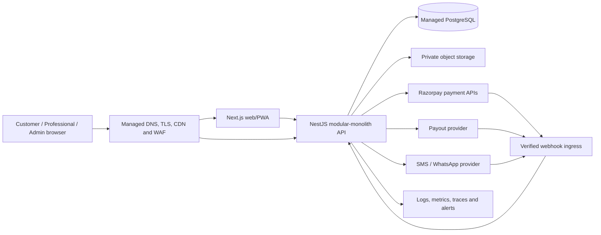

# 15 Deployment

## Document Status

- Status: Target v1 deployment and release specification
- Implementation state: The repository has CI, Dockerfiles, Compose, and build scripts, but no
  staging/production delivery workflow. Docker execution has not been verified on the current
  workstation because Docker CLI is not installed.
- Provider state: Frontend, backend, database, object storage, SMS/WhatsApp, payout, secrets,
  observability, and DNS/CDN providers are not all finalized. Items marked **Decision pending** must
  be approved before production.

## Deployment Goals

1. Promote the same reviewed source revision and immutable artifacts through environments.
2. Prevent a release unless install, formatting, Markdown, lint, typecheck, tests, schema validation,
   security checks, and production builds pass.
3. Apply database changes safely without losing booking or financial history.
4. Keep the web/PWA, API, PostgreSQL, providers, and background work observable and recoverable.
5. Support city-by-city growth without changing the modular-monolith architecture.
6. Make rollback, reconciliation, backup restoration, and incident ownership explicit.

## Current Repository Baseline

| Area        | Current state                                                                                                                           |
| ----------- | --------------------------------------------------------------------------------------------------------------------------------------- |
| Monorepo    | pnpm 11.10.0 workspaces and Turborepo 2.10.4                                                                                            |
| Runtime     | Node.js 24 selected by `.nvmrc` and Docker; package engine allows Node.js 22 or newer                                                   |
| Web         | Next.js 16.2.10, React 19.2.4, Tailwind CSS 4; standalone output enabled                                                                |
| API         | NestJS 11 scaffold listening on `API_PORT` or 4000                                                                                      |
| Database    | Prisma 7.8 configuration and PostgreSQL datasource; no models or migrations yet                                                         |
| Local stack | PostgreSQL 18 Alpine, API, and web services in `docker-compose.yml`                                                                     |
| CI          | GitHub Actions frozen install, Prisma generation, format, lint, typecheck, test, and build on `develop`/`main` pushes and pull requests |
| Images      | Multi-stage web and API Dockerfiles with non-root runtime users                                                                         |

The current Compose stack is a development foundation, not a production topology.

## Target Runtime Topology



Approved hosting direction from the tech stack:

- frontend on Vercel or an equivalent managed/container platform;
- API on managed Node.js or managed container hosting;
- PostgreSQL on a managed database service;
- cloud object storage for private verification/portfolio/support assets.

Exact providers, regions, data-residency controls, service tiers, domains, WAF/CDN, and cost limits
are **Decision pending architecture, operations, security, finance, and legal review**.

## Deployment Units

| Unit               | Artifact                                                                      | Requirements                                                                                                |
| ------------------ | ----------------------------------------------------------------------------- | ----------------------------------------------------------------------------------------------------------- |
| Web                | Next.js standalone image or provider-native immutable build                   | Browser-resolvable API routing, immutable public configuration, CDN-safe public assets, no secrets          |
| API                | Versioned Node/container artifact from `apps/api`                             | Stateless HTTP process, graceful shutdown, health probes, database/provider configuration, non-root runtime |
| Background work    | Same modular-monolith code/artifact invoked as controlled worker or scheduler | PostgreSQL-backed outbox, bounded retries, distributed/advisory lock where multiple instances run           |
| Database migration | Reviewed Prisma migration bundle from the same commit                         | One controlled execution per environment using migration credentials                                        |
| Reference seed     | Idempotent approved seed task                                                 | Reference data only; never credentials or personal data                                                     |

A separately deployed worker is a process boundary of the same modular monolith, not a microservice.
Whether Phase 1 uses an API-hosted scheduler or separate worker process is **Decision pending — Architecture and Operations review using measured workload and hosting capability**.

## Environments

| Environment | Purpose                                                                        | Data/provider policy                                                   | Promotion                                             |
| ----------- | ------------------------------------------------------------------------------ | ---------------------------------------------------------------------- | ----------------------------------------------------- |
| Local       | Developer feedback and isolated migration work                                 | Local/sandbox data and provider stubs or sandbox accounts only         | Developer command                                     |
| CI          | Reproducible validation                                                        | Disposable PostgreSQL and provider fixtures; no production credentials | Every relevant push/PR                                |
| Staging     | Production-like acceptance, provider sandbox, migration and rollback rehearsal | Synthetic/test data; separate keys, database, bucket and domains       | Successful `develop` pipeline                         |
| Production  | Approved Sikar launch workload                                                 | Production accounts, private managed data services, monitored backups  | Reviewed `main` release with approval; no direct push |

Environment boundaries are strict. Databases, storage, secrets, signing keys, payment accounts,
notification accounts, payout accounts, logs, and analytics must not be shared between staging and
production.

## Local Development

Non-container flow:

1. Use Node.js 24 and pnpm 11.10.0.
2. Copy `.env.example` to `.env` and use local-only values.
3. Start PostgreSQL 18 locally or through Docker.
4. Run `pnpm install --frozen-lockfile`.
5. Run `pnpm db:generate`.
6. After migrations exist, run `pnpm db:migrate` for the developer database.
7. Run `pnpm dev`.

Default local ports are web `3000`, API `4000`, and PostgreSQL `5432`.

Compose flow is a target convenience command after Docker is installed and image execution is
verified. Do not infer production readiness from `docker compose up` alone.

## Configuration and Secrets

### Existing Variables

| Variable                                            | Scope            | Secret             | Notes                                                                 |
| --------------------------------------------------- | ---------------- | ------------------ | --------------------------------------------------------------------- |
| `NODE_ENV`                                          | API/web runtime  | No                 | Must match environment behavior.                                      |
| `DATABASE_URL`                                      | API/migration    | Yes                | PostgreSQL connection; never expose to web/public build.              |
| `POSTGRES_DB`, `POSTGRES_USER`, `POSTGRES_PASSWORD` | Local Compose    | Password is secret | Development defaults only; not production configuration.              |
| `API_PORT`                                          | API runtime      | No                 | Defaults locally to 4000.                                             |
| `NEXT_PUBLIC_API_URL`                               | Web build/client | No                 | Public values are visible to browsers and must never contain secrets. |

### Target Variable Groups

Names may be refined during implementation, but every environment requires validated equivalents:

- public URLs: application origin, browser-resolvable API origin or same-origin route, allowed CORS
  origins;
- JWT/session: issuer, audience, access public/private signing keys, key id, token lifetimes, cookie
  domain/path/security settings;
- OTP/SMS: provider, account/key, sender/template identifiers, webhook secret;
- Razorpay: key id, secret, webhook secret, environment/mode;
- payout: provider credentials, webhook secret and account configuration;
- WhatsApp: provider credentials, approved template identifiers and callback secret;
- object storage: region/endpoint, private bucket, scoped credentials, signing/encryption settings;
- application encryption: key-service reference and active key version;
- observability: service/environment/release identifiers, exporter endpoints and scoped tokens;
- feature/configuration: active city/service-area configuration and approved safe operational flags.

Exact names, providers, lifetimes, regions, and rotation schedules are **Decision pending — Architecture, Operations, Security, Privacy, Legal, and provider review**. Validate
all required variables at process startup with a typed schema and fail closed on missing/invalid
production configuration.

Secrets must come from a managed secret store or platform secret facility. They must not be committed,
placed in `.env.example`, baked into images, logged, exposed through `NEXT_PUBLIC_*`, or copied into
support systems.

## Public API Routing

The deployment must choose one of these reviewed patterns:

1. same-origin web routing/proxy to `/api/v1`; or
2. an explicit browser-resolvable API origin with a strict web-origin CORS allowlist.

The current Compose value `NEXT_PUBLIC_API_URL=http://api:4000` is an internal Docker hostname and is
not generally resolvable by a user's browser. It is also supplied at container runtime even though
`NEXT_PUBLIC_*` values may be embedded during `next build`. Before web/API integration, Compose and
deployed builds must inject the correct public value at build time or adopt same-origin routing.

Exact public domains and routing pattern are **Decision pending — Architecture, Operations, Security, and hosting/DNS provider review**.

## Build and Continuous Integration

### Reproducible Build Commands

```text
pnpm install --frozen-lockfile
pnpm db:generate
pnpm format:check
pnpm lint
pnpm typecheck
pnpm test
pnpm build
```

The root Prettier configuration currently ignores `docs` and README files. Documentation releases
must therefore run an explicit Markdown formatter check with a suitable ignore path plus a Markdown
link/style validator; passing the existing `pnpm format:check` alone does not validate documentation.

### Target CI Gates

1. Checkout an immutable revision and install the declared Node/pnpm versions.
2. Frozen dependency installation and Prisma Client generation.
3. Prettier, Markdown formatting/link validation, ESLint, and TypeScript checks.
4. Unit tests with required coverage policy.
5. Disposable PostgreSQL migration apply/rollback rehearsal where reversible, schema drift check,
   database integration tests, and deterministic seed test.
6. API e2e, authorization/redaction, state-transition, idempotency, concurrency, wallet invariant,
   and provider-fixture tests.
7. Next.js and NestJS production builds.
8. Docker build verification for web/API where containers are a supported delivery artifact.
9. Secret, dependency, license, SAST, container, and infrastructure scan.
10. Generate immutable artifact/image digests, dependency inventory/SBOM, and release metadata.

Exact coverage threshold, vulnerability SLA, signing service, registry, and SBOM format are
**Decision pending engineering and security review**. Critical/high unresolved security findings
block release unless an accountable, time-limited exception is approved.

## Branch and Promotion Strategy

- Feature work enters `develop` through reviewed branches and pull requests.
- A successful `develop` pipeline may deploy the immutable commit to staging.
- Production promotion uses a reviewed release pull request to `main`; direct pushes to `main` are
  prohibited.
- Production requires CI success, staging acceptance, migration review, security status, backup
  readiness, release notes, and manual environment approval.
- Tag/releases and artifacts identify the exact commit SHA, database migration set, build time, and
  artifact digest.
- Promote the already-built artifact where the platform supports it. If provider-native rebuilding
  is unavoidable, use the same commit, lockfile, toolchain, and recorded build inputs.

## Database Migration Deployment

Production database changes follow expand/migrate/contract:

1. Review generated Prisma migration SQL and any manual PostgreSQL constraints.
2. Apply and test from an empty database and the previous production-like schema in CI/staging.
3. Estimate lock/duration risk and define abort/monitoring criteria.
4. Verify a recent encrypted backup and restore procedure before a risky migration.
5. Put compatible expand changes into production with `pnpm db:deploy` as a one-off controlled job.
6. Deploy backward-compatible application code.
7. Backfill in resumable, observable batches if needed.
8. Remove old columns/constraints only in a later release after all code stops using them.

`prisma migrate dev` is never run in staging or production. Application replicas must not race to run
migrations at startup. The API runtime uses least-privilege credentials; the migration job uses a
separate controlled identity.

Database rollback normally means rolling the application back while retaining compatible expanded
schema, then forward-fixing the migration. Destructive reverse SQL is used only after backup/impact
review. No rollback may silently discard Booking or financial history.

## Deployment Sequence

1. Freeze the approved commit and release metadata.
2. Confirm CI/security gates and staging sign-off.
3. Confirm provider status, support coverage, monitoring, and recent database backup.
4. Apply approved backward-compatible migrations.
5. Deploy API/background artifact with production secrets and migrations already complete.
6. Wait for liveness/readiness and smoke-test auth, discovery, Booking-safe reads, and provider
   connectivity without creating uncontrolled money movement.
7. Deploy web/PWA with the correct immutable public API configuration.
8. Verify CDN/cache behavior, PWA assets, CORS/CSRF/security headers, and end-to-end synthetic flow.
9. Observe errors, latency, saturation, provider callbacks, database health, queue/outbox lag, and
   financial reconciliation during the release window.
10. Record completion or execute the rollback plan.

Exact maintenance window, canary percentage, approval roles, and launch-day coverage are **Decision
pending operations review**.

## Health, Startup, and Shutdown

Target API probes:

- `/api/v1/health/live`: confirms the process/event loop is alive without exposing dependencies.
- `/api/v1/health/ready`: confirms required database connectivity and readiness to accept traffic.

The web deployment needs a provider/container health path that verifies the server can render a safe
page. Health output must not expose connection strings, provider secrets, stack traces, private host
names, or detailed versions.

On shutdown, the API must stop accepting new work, finish or safely abandon in-flight requests,
release resources, and leave retryable background/outbox work durable. Exact probe intervals,
startup timeout, graceful-shutdown period, and dependency criteria are **Decision pending platform
review**.

The current Compose stack checks PostgreSQL health only; it has no API/web health checks or graceful
shutdown verification.

## Release and Rollback

Rollback triggers include sustained error/latency regression, failed health checks, auth failure,
unexpected Booking-state errors, payment/webhook mismatch, wallet reconciliation difference,
database saturation, or security incident.

Rollback procedure:

1. Pause rollout and unsafe background/provider commands.
2. Preserve logs, traces, audit, webhook, and release evidence.
3. Revert traffic to the last compatible immutable web/API artifacts.
4. Keep expanded compatible schema unless a separately reviewed reverse migration is safe.
5. Reprocess durable outbox/webhook work idempotently after state is verified.
6. Reconcile Bookings, payments, refunds, commission, wallet, withdrawals, and payouts.
7. Communicate operational impact and complete a post-incident review.

PWA/service-worker releases require special cache/version testing so rollback does not strand clients
on incompatible cached assets or API assumptions.

## Observability and Operational Alerts

Every deployed service emits structured logs, metrics, and traces tagged with service, environment,
release commit, request/trace id, and safe domain identifiers.

Monitor at minimum:

- request rate, error rate, latency, saturation, restarts, readiness and release changes;
- PostgreSQL connections, query latency, locks, storage, replication/PITR/backup status;
- Booking counts and time in each nonterminal state;
- assignment acceptance/timeout and slot-conflict rates;
- OTP request/delivery/verification failures and abuse signals;
- Razorpay order/capture/refund webhook verification and processing lag;
- completion OTP failures and manual overrides;
- outbox/notification/provider retry lag and dead work;
- commission/ledger creation, holds due for release, reconciliation differences;
- withdrawal/payout age, failure, retry, and dispute/risk holds;
- support ticket age, dispute age, and security/admin audit anomalies.

Exact SLOs, alert thresholds, dashboards, telemetry provider, on-call rota, escalation times, and log
retention are **Decision pending after capacity and operations review**.

## Backup, Restore, and Disaster Recovery

- Use encrypted automated PostgreSQL backups and point-in-time recovery on the managed service.
- Protect backup deletion with separate privileges and provider retention controls.
- Version/protect private object storage consistently with approved retention.
- Document restoration of database, object metadata/content, configuration, secrets, provider
  callback configuration, and application artifacts.
- Test restore into an isolated environment on a schedule and verify financial reconciliation after
  restore.
- Keep infrastructure and migration definitions reproducible from version control.

Production RPO, RTO, backup frequency/retention, restore-test cadence, cross-region strategy, legal
retention, and outage communication are **Decision pending business, operations, finance, security,
and legal review**.

## Scaling and Resilience

- Keep API instances stateless; sessions, idempotency, and authoritative state reside in PostgreSQL.
- Scale web/API horizontally only after load testing and database connection-pool sizing.
- Use CDN caching only for public immutable assets and explicitly safe public responses.
- Use indexed PostgreSQL queries and cursor pagination; add replicas/search/cache only from measured
  need and an approved design.
- Use the transactional outbox and bounded retry workers for provider operations.
- Use an advisory/distributed lock for scheduled hold release, reminders, reconciliation, and payout
  polling when multiple instances can run.
- Payment, payout, SMS, WhatsApp, or storage outage must not create false success. Persist safe pending
  state and expose an understandable retry/support path.
- Capacity targets and load-test scenarios are **Decision pending expected Sikar launch volume and
  measured behavior**.

## Production Readiness Gates

Production launch is blocked until:

- the Prisma model and reviewed migrations implement required entities and financial constraints;
- the API implements versioning, configuration validation, health checks, graceful shutdown,
  authentication/authorization, validation, audit, provider verification, and idempotency;
- web/PWA uses a valid browser API route and passes install/cache/update testing;
- Docker/provider-native builds are reproducible and tested in staging;
- migration, seed, backup, restore, rollback, reconciliation, and provider-outage exercises pass;
- CI includes database, e2e, Markdown, supply-chain, security, and image gates appropriate to the
  chosen deployment;
- production secrets, private networking, TLS, WAF/CORS/CSRF/headers, object-storage protection,
  monitoring, alerts, on-call, and incident runbooks are active;
- Razorpay, OTP/SMS, WhatsApp, payout, storage, hosting, and database production accounts and
  callbacks are approved and sandbox/staging tested;
- all relevant business, cancellation/refund, commission, tax, payout, privacy, retention, consumer,
  Professional, and provider terms marked **Decision pending** have approved owners and outcomes.

## Current Docker Gaps

Before the existing Docker setup can be called production-ready:

- install Docker locally or use CI to build and run both images and Compose;
- add API/web health checks and verify graceful shutdown;
- generate/include Prisma Client and run migrations through a separate job after models exist;
- correct public API URL injection/routing and configure API CORS;
- add runtime secret injection, TLS/ingress, resource limits, read-only filesystem where compatible,
  image scanning/signing, and immutable registry tags;
- verify Next.js standalone monorepo paths and static/public assets in a clean build context;
- run smoke, integration, provider-sandbox, migration, and rollback tests against the built images;
- replace local PostgreSQL with a protected managed production service rather than deploying the
  Compose database as the production system of record.
